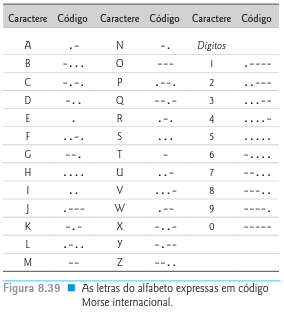

# Morse Code

**......-...-..---   .-----.-..-..-.. !**

For who does not understand the Morse code it says  *" Hello World !"*. This is my first of many projects in C I will upload in my GitHub. I am very happy because it is the first complex program I wrote until today ! However it is not finished yet, so I will still write some line of code to finish the program, but in its core ( the real purpose : translate ) its finished.

## Informations About the Project

The project is a exercise of a book called C how to Program by Paul Deitel and Harvey Deitel. The exercise is part of Chapter 8 that discuss and teaches about Characters and Strings Functions. So I will let the enunciation down below : 

**Morse code**. 

Perhaps the most famous of all coding schemes is Morse code, developed by Samuel Morse in 1832 for use in conjunction with the telegraph system telegraph system. Morse code assigns a series of dots and dashes to each letter of the alphabet, each digit, and some special characters (such as a period, comma, colon and semicolon). and semicolon). In sound-oriented systems, the represents a short sound and the dash represents a long long sound. Other representations of dots and dashes are used with light-oriented systems and signaling flag signaling systems. Separation between words is indicated by a space -simply the absence of a dot or a dash. In a sound-oriented system, a space is indicated by a short period of time during which no sound is transmitted. The international version of Morse code appears in Figure 8.39

Write a program that reads a sentence in Portuguese
and encode it into Morse code. Also write a program that reads a phrase in Morse code and converts it to the to the Portuguese equivalent. Use a space between each letter of the Morse code and three spaces between each word in Morse code

## Problems Faced

I can list many obstacles I faced ( and continue facing ) during this project. I think is important write this part because through this I can see my weaknesses. So let do this !

**Q:**  How can I make the computer recognize the letters both in Portuguese and Morse Code ? 

**A:** This part was not too difficult to solve but it took some minutes to see the solution 

**Q:** How can I separate the letters of a word ? 

**A:** I knew the solution was iterate along the array of chars, but as I was manipulate pointers this part shows me that pointers still catch me.

**Q:** What functions of String Library can be useful for this task ? 

**A:** I admit,  this is the part of the project took 2 days to find the correct function this job. I had to search in StackOverflow, Tutorials Sites and Re read the book so many times to find it.   

## About Me

As you can see in my GitHub I am Thiago Marcelo from São Paulo, Brazil. While I was doing this project I am studying at Fatec de Mogi das Cruzes, a college from my region. I hope this is the one of many project I will develop and upload to GitHub.  

